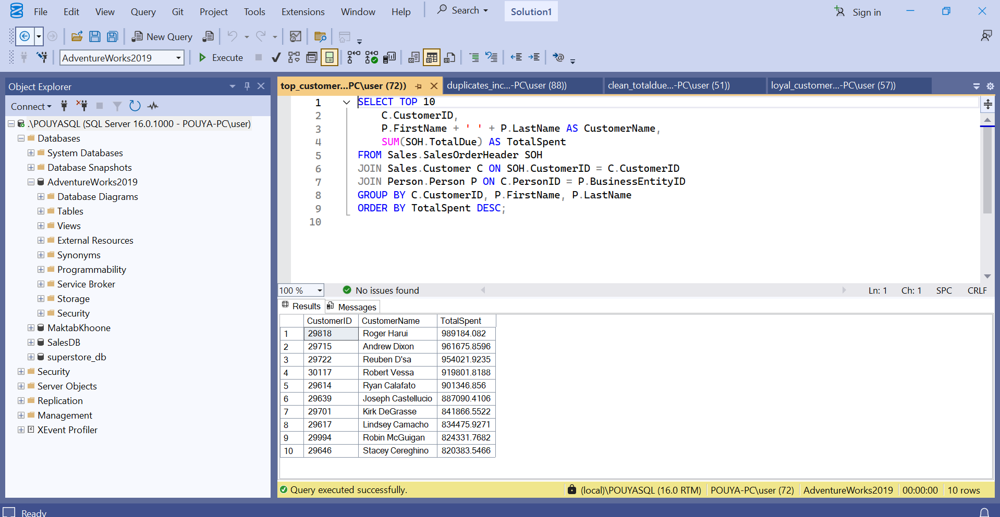
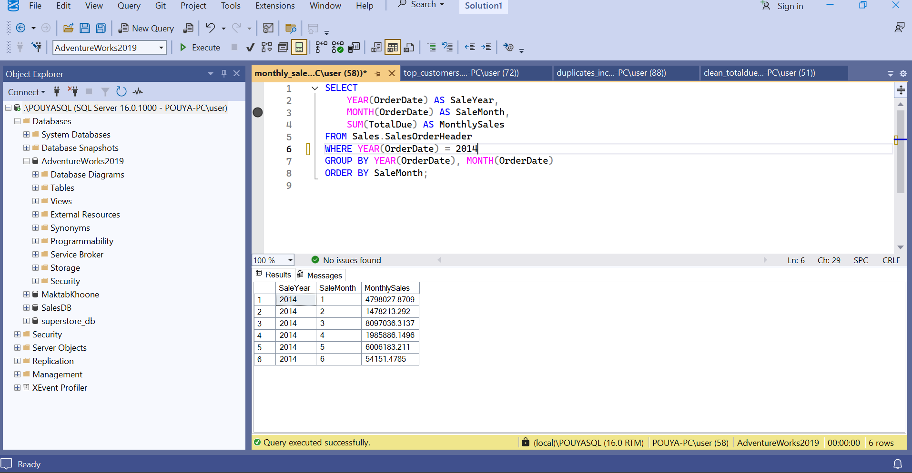

# AdventureWorks SQL Project

This project is a collection of SQL queries I wrote for practice using the **AdventureWorks2019** sample database (SQL Server).  
It includes both **analysis queries** (to get business insights) and **data quality checks** (to show how to handle data issues).

---

## 📊 Analysis Queries
These queries answer common business questions:

1. **Top Customers**  
   Find the top 10 customers based on total spending.  
   

2. **Monthly Sales**  
   Show sales totals for each month in a given year.  
   

3. **Top Products**  
   List the most sold products by quantity.  

4. **Average Order per City**  
   Calculate the average order value grouped by customer city.  

5. **Loyal Customers**  
   Identify customers with more than one order.  

---

## 🧹 Data Cleaning Queries
These queries check for possible data quality issues:

1. **Null Handling & Outliers**  
   Replace NULL values with defaults, mark very large or invalid order amounts.  

2. **Duplicates & Inconsistent Dates**  
   Detect duplicate customer records and check if shipping dates are earlier than order dates.  
   

---

## 📂 Project Structure
AdventureWorks-SQL-Project/
│
├── README.md
├── queries/
│ ├── top_customers.sql
│ ├── monthly_sales.sql
│ ├── top_products.sql
│ ├── avg_order_per_city.sql
│ └── loyal_customers.sql
│
├── cleaning/
│ ├── clean_totaldue.sql
│ └── duplicates_inconsistent.sql
│
└── screenshots/
├── top_customers.png
├── monthly_sales.png
└── duplicates_inconsistent.png

---

## 🚀 How to Use
1. Download and restore the **AdventureWorks2019** database in SQL Server.  
2. Open each `.sql` file in SSMS.  
3. Run the query to see results.  

---

## 🔑 Purpose
- Practice real SQL skills on a realistic database.  
- Show both **analysis** and **data cleaning** in a simple, practical way.  
- Use it as part of my data analyst portfolio.
